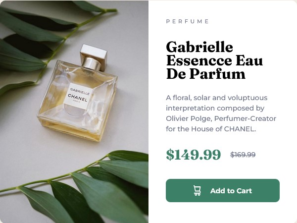

# Frontend Mentor - Product preview card component solution

This is a solution to the [Product preview card component challenge on Frontend Mentor](https://www.frontendmentor.io/challenges/product-preview-card-component-GO7UmttRfa). Frontend Mentor challenges help you improve your coding skills by building realistic projects. 

## Table of contents

- [Overview](#overview)
  - [The challenge](#the-challenge)
  - [Screenshot](#screenshot)
  - [Links](#links)
- [My process](#my-process)
  - [Built with](#built-with)
  - [What I learned](#what-i-learned)
  - [Continued development](#continued-development)
  - [Useful resources](#useful-resources)
- [Author](#author)
- [Acknowledgments](#acknowledgments)

**Note: Delete this note and update the table of contents based on what sections you keep.**

## Overview

One card component.

Used Sass for styling.

Implemented media queries for the first time in a FM's challenge.
Used BEM for class names and thought a good HTML structure first before styling it.

### The challenge

Users should be able to:

- View the optimal layout depending on their device's screen size
- See hover and focus states for interactive elements

### Screenshot

### Links

- Solution URL: [https://www.frontendmentor.io/solutions/product-preview-card-component-7JJOl-b1ew](https://www.frontendmentor.io/solutions/product-preview-card-component-7JJOl-b1ew)
- Live Site URL: [https://product-preview-card-component-sung.netlify.app/](https://product-preview-card-component-sung.netlify.app/)

## My process

### Built with

- Semantic HTML5 markup
- CSS custom properties
- CSS Grid
- [CSS reset](https://github.com/mayank99/reset.css) - To baseline cross-browser styles

**Note: These are just examples. Delete this note and replace the list above with your own choices**

### What I learned

- How to structure a good HTML first.
- Landmarks: header, main, aside and footer.
- Picture element for images
- Ribbon text, headings and hgroup element for wrapping headings for a more visual-friendly structure.
- <s> and <del> elements for a better accesibility.
- When to use <button> and <a> for buttons.
- Testing the final website with keyboard and screenreader for accesibility.

### Continued development

My main focus now is to create a well-structured HTML first. Also to keep implementing what I've learned for this project. Next step, I would like to use a better <button> and <a> classnames for styling the base first (.btn, .link), and then use a modifier for each specific button (btn--primary, btn--secondary, etc &&  link--primary, link--secondary, etc).

### Useful resources

- [BEM](https://getbem.com/introduction/)
- [Tweaking Text Level Styles](https://adrianroselli.com/2017/12/tweaking-text-level-styles.html) - For accesibility: <s>, <del>, <mark>, <ins>.

**Note: Delete this note and replace the list above with resources that helped you during the challenge. These could come in handy for anyone viewing your solution or for yourself when you look back on this project in the future.**

## Author

- Frontend Mentor - [@sung92](https://www.frontendmentor.io/profile/sung92)

## Acknowledgments

I want to thank Grace Snow who helped me on this project and HTML+CSS in general 🙌